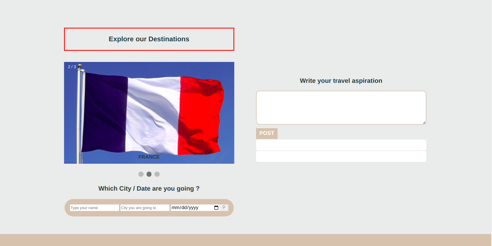

# travel match-project

## The Problem Statement

Many people strongly desire to escape from their native location for a better life and success. Whether you are a student aiming for quality education, a poor citizen dreaming of an excellent job placement, or an individual looking to tour other regions worldwide, Traveling or relocating can be challenging.

## solution

We offer services that meet your expectations by providing invitations, booking, and care from A to Z upon arrival. One of our strengths? Our local specialized in their living area. A team of individuals that allows simple and harmonious travel between countries. 

## Solution proposal in images

## Solution Description

Travel Match integrates travel solution APIs, particularly Amadeus APIs, to collect and process data provided by users. 
Features are: 
- Detailed description of our services 
- Display an easy setup and flexible integration of travel preferences and services through the travel APIs.
- Search for destinations and services based on Keywords
- Form application to apply for any destination plus services. This form is not permissive and in the future will add a filled database under the form recording the users' selection.
